<!-- PROFILE README — Youssef Ashraf -->

# Hello world, I’m **Youssef Ashraf** 👋✨

**Computer Science (Dual Degree) undergrad** • **iOS Developer (Swift/SwiftUI)** • **Content Creator**

 

---

## 🚀 About Me

- 🎓 **CS Student** (Dual Degree)  
- 📱 **iOS-focused**: Swift / SwiftUI / UIKit  
- 🧠 **Problem-solving mindset**: data structures, algorithms, and “figure it out” engineering  
- 🎥 I create videos on **data structures** + general programming:  
- 🎧 Hobbies: mixing & mastering tracks, exploring tech, traveling 🌍

---

## 🧰 Tech Toolbox (What I actually use)

### Languages

### iOS / Apple Frameworks

### Tools / Services

---

## ✨ Highlights

<!-- quick value cards -->
<table>
  <tr>
    <td align="center" width="260">
      <b>📱 iOS Craft</b> 
      State-driven UI • Architecture • UX polish
    </td>
    <td align="center" width="260">
      <b>📷 Real-time Vision</b> 
      AVFoundation • Vision • Core ML
    </td>
    <td align="center" width="260">
      <b>🎥 Teaching</b> 
      Data structures + programming content
    </td>
  </tr>
</table>

---

## 📈 GitHub Stats

<!-- If images sometimes show as broken icons, it's usually the theme parameter or GitHub caching.
     These are the most reliable variants (no custom theme), plus a direct markdown fallback below. -->

---
## 🤝 Let’s Connect

- 💻 GitHub: https://github.com/yousseeefashrraf  
- 🎥 YouTube: https://www.youtube.com/@YooussefAshraf/videos  
- 📧 Email: mailto:youssseeefashrraf@gmail.com  

---

🌟 _“Discipline ships. Curiosity scales.”_  
🌟 _"The only limit to our realization of tomorrow is our doubts of today."_ – Franklin D. Roosevelt  

<!--
**yousseeefashrraf/yousseeefashrraf** is a ✨ _special_ ✨ repository because its `README.md` (this file) appears on your GitHub profile.

Here are some ideas to get you started:

- 🔭 I’m currently working on ...
- 🌱 I’m currently learning ...
- 👯 I’m looking to collaborate on ...
- 🤔 I’m looking for help with ...
- 💬 Ask me about ...
- 📫 How to reach me: ...
- 😄 Pronouns: ...
- ⚡ Fun fact: ...
-->
